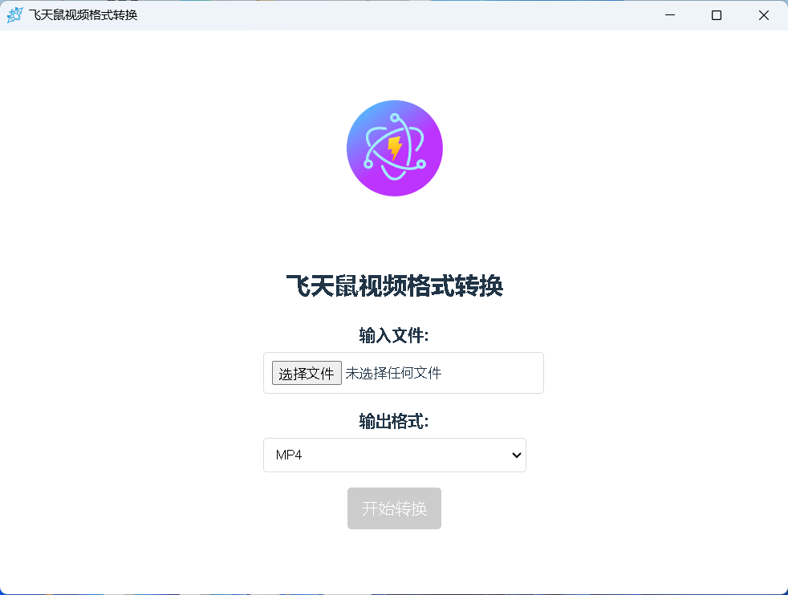

# videoconvert

## 官网
[右键点击 -> 访问飞天鼠](https://tool.feitianshu.com/video-convert/)

## ffmpeg
    下载ffmpeg并解压到resources目录下，最后的文件路径如: resources/ffmpeg.exe
    注意是整个ffmpeg的文件，包括以来的DLL等

## 运行
    yarn install    #安装依赖库
    yarn run dev    #运行 在超级管理员权限的CMD下执行
    yarn run build  #打包

## 系统要求
    目前只做了windows的版本，纯粹最近整理电脑的时候，发现以前练手的项目
    所以没有做MAC linux的版本

## 涉及技术
    electron
    electron-builder
    vue3
    vite
    typescript
    ffmpeg

## 模板
    https://github.com/electron-vite/electron-vite-vue

